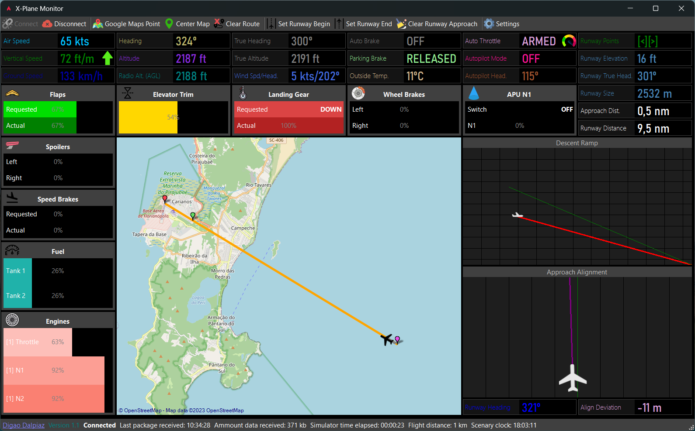
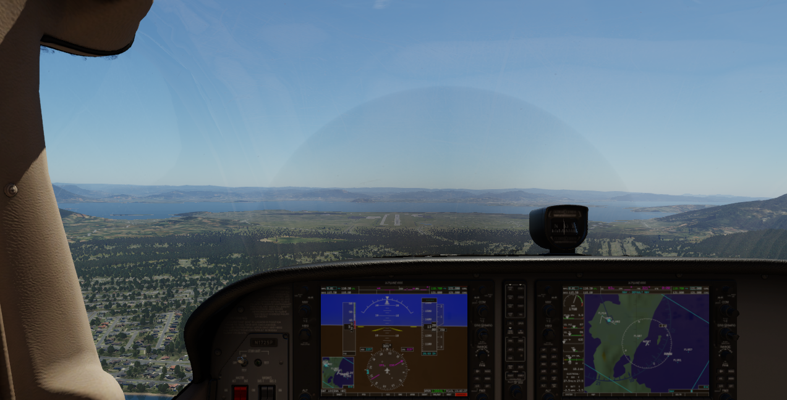

# X-Plane Monitor

X-Plane Windows desktop app providing real time flight controls, instruments, parameters, map, ramp graph (vertical alignment) and lateral positioning (horizontal alignment).

## Description

This is an application made in .NET Core 6, using WinForms, to be executed together with X-Plane, in order to show the flight parameters, helping you to flight without looking to the plane controls in the simulator, and helping you to land ANY aircraft.

I developed this program because, several times using the simulator, I came across the difficulty of knowing the current status of a certain parameter during a flight.

## Motivation

### Example 1

You are landing the plane, and at this moment you need to make several parameters, but you don't have a copilot to help you because you are just using the simulator, and you want to keep the screen with the view from the window, to see the runway.

So, let's say you want to lower the flaps. In the simulator, you can use the keyboard or the joystick for this, but you will not get feedback that it was actually performed on the aircraft. And normally, with the view from the window you will not be able to see the flaps lever at the same time.

Several times using the simulator, it occurred to me to command the flaps and then discover that they had not lowered, or else to command the landing gear and wonder if it worked.

### Example 2

You want to take off the plane with the outside view, that is, seeing the plane from the outside. In this view, X-Plane does not offer you the visualization of the instruments, which are extremely important at takeoff. With the Panel app you will be able to appreciate the external view and follow the instruments in the app, making a perfect takeoff.

### Conclusion

With these situations in mind, I developed this application that communicates using UDP socket with X-Plane and shows several parameters of the aircraft in real time, including the commanded values and the values in operation. For example, if you command the flaps, there is the value you commanded, and the actual surface position.

**To use this application together with the simulator, it is essential to have 2 monitors. If not, you can also use the application on another computer, communicating over a network (please allow X-Plane app and this application in your Windows firewall).**

## How to use

1. Open XPlaneMonitorApp.exe

2. Configure X-Plane host and port (if using in the same machine as the simulator, just use default settings).

3. Click in the "Connect" button and enjoy!

## Requirements

This app requires .NET Core 6 x64 Runtime.

Supports X-Plane 11 and 12.

## How this software works

X-Plane provides UDP connection, allowing any third software communication. This app takes advantage of X-Plane UDP port, and receives several flight parameters. You can configure the frequency of parameters update. I recommend you to keep this parameter in default value.

## Configuring flight approach

The app allows you to configure the runway information, giving you very useful information about the approach.

**To use this feature, you must point out the start and end point of the runway on the map.**

Once this is done, the application will obtain the altitude of the airport from the Internet, and calculate the parameters according to the current position of the aircraft.

You can also configure the descent ramp, telling you the **elevation** and **distance** of the ramp. With this, the application will draw a **green line** with the ideal ramp, and a **red line** with the ramp that the aircraft is running.

In addition, the application also draws a longitudinal alignment view, where it is possible to know what deviation the aircraft is from the runway line. At the same time, the deviation distance in meters is informed.
